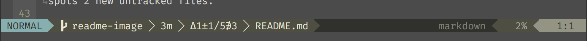

# git-info.vim

A **neovim** plugin that extracts git repo information to a few global variables for use in your status line (or other things).

Information is extracted via asynchronous background jobs either on buffer load and save.

Information is relative to the current buffer, not vim current working directory.

Currently, `git-info` is not compatible with VIM due to incompatibilities in the async job API.

# Installation

`git-info` requires `neovim v0.3.1+` and is only tested with at least `git v2.20+`.

## Using [vim-plug](https://github.com/junegunn/vim-plug)

    Plug 'rktjmp/git-info.vim'

# Usage

`git-info` exposes the following functions:

- `git_info#branch_name()`: the name of the current branch.

- `git_info#last_commit_timestamp()`: a number representing the unix timestamp of the last git commit.
  - `-1` if no commit has been made.
  - You can convert this to a readable format with [time-ago.vim](http://github.com/rktjmp/time-ago.vim) ("10 days ago") or to date with `strftime`. 

- `git_info#changes()`: a map containing the following keys:
  - `changed`: number of files with uncommitted changes.
  - `insertions`: number of `diff` insertions (linewise).
  - `deletions`: number of `diff` deletions (linewise).
  - `untracked`: number of untracked files in the repository directory.
  - `as_string`: a condensed & opinionated representation of the changes.
    - `''` if no changes or untracked files.
    - `Δ2±3/4∌1`: should be read as "the repo delta contains 2 altered files with 3 insertions and 4 deletions. 1 file is untracked (not included in the change set)".
    - `Δ5±0/6`: 5 files changed, 0 insertions, 6 deletions, no untracked files
    - `Δ0∌2`: 0 files changed, 2 untracked files

## [Lightline](http://github.com/itchyny/lightline.vim) Configuration Example

    let g:lightline = {
          \ 'component_function': {
          \   'git_branch': 'LightlineGitBranchName',
          \   'git_commit_age': 'LightlineGitLastCommit',
          \   'git_status': 'LightlineGitStatus',
          \   'git_dirty': 'LightlineGitDirty',
          \ },
          \ 'active' : {
          \   'left': [['mode', 'paste'], ['git_branch', 'git_dirty', 'git_commit_age', 'git_status', 'filename']]
          \ },
          \ }

    function! LightlineGitBranchName()
      " check if branch name is set, add icon
      " else return nothing which hides the subsection
      " if you did not want the icon you could just return the branch name
      " without checking, which will be blank if not inside a git repo
      if len(git_info#branch_name())
        return '⭠ ' . git_info#branch_name()
      endif
      return ''
    endfunction

    function! LightlineGitDirty()
      " dirty flag is left to the user since there are differening opinions
      " on whether untracked files count towards 'dirty' status
      " git_info#changes().as_string provides the same information
      let l:changes = git_info#changes()
      if l:changes.changed > 0 || l:changes.untracked > 0
        return '*'
      endif
      return ''
    endfunction

    function! LightlineGitStatus()
      " return the as_string representation, which will be '' if no changes
      " are present, which will hide the subsection
      return git_info#changes().as_string
    endfunction

    function! LightlineGitLastCommit()
      let l:timestamp = git_info#last_commit_timestamp()
      " check if there is no last commit
      if l:timestamp == -1
        " hide subsection
        return ''
      endif
      " have a commit, convert it to a fuzzy phrase
      let l:phrase = time_ago#fuzzy(l:timestamp)
      " minimise the terms
      let l:phrase = substitute(l:phrase, 'under a minute', '<1m', '')
      let l:phrase = substitute(l:phrase, '\v weeks?', 'w', '')
      let l:phrase = substitute(l:phrase, '\v days?', 'd', '')
      let l:phrase = substitute(l:phrase, '\v hours?', 'h', '')
      let l:phrase = substitute(l:phrase, '\v minutes?', 'm', '')
      " remove ', ' if present
      let l:phrase = substitute(l:phrase, '\v, ', '', '')
      return l:phrase
    endfunction

# Notes

- Renaming a file with no changes will return 1 file changed and 0 insertions, 0 deletions, 0 untracked.
- Due to the behaviour of git, status details may not be what you expect until at least one commit has been made to a repository.

# Bugs

You will sometimes see spurious counts for 'untracked files' when another process is watching for changes in a file you edit.

An example of this might be `exuberant ctags` if set to create tag files in your working dir.

On save, ctags will create `tags.temp` and `tags.lock`, update `tags` then remove `tags.temp` and `tags.lock`. However our `git status` command is run during this time and spots 2 new untracked files.

The solution to this is adding the additional files to your `.gitignore`.

# TODO

[ ] Remote ahead/behind tracking
